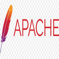

# Deliverable 1 Submission

## Basic Terminology

### What is a web server?
A web server is a software and hardware that uses HTTP(Hypertext Transfer Protocol) and other protocols to respond to client requests made over the World Wide Web. The main job of a web server is to display website content through storing, processing and delivering webpages to users. 

### What is Apache?
 
A directive in a configuration option. /etc/httpd/conf/http.conf

### What are some example web server applications?

| Application Name | license                          | Project's Website                   |
| ---------------- | -------------------------------- | ----------------------------------  |
| Example 1        | GNU General Public License (GPL) | [example 1](https://www.gnu.org)    |
| Example 2        | Apache License 2.0               | [example 2](https://www.apache.org) |
| Example 2        | MIT license                      | [example 3](https://mit-license.org)|

#### Example 1
 
WordPress is a free and open-source content management system based on PHP & MySGL. Features include plugin architecture and a template system. 

#### Example 2
 
A type that defines the implementation of a particular kind of object. An object is created from a class. In java, the new keyword is used to create new objects from software. 

#### Example 3
 
Mit License means permissive free, you are allowed to do anything you want with MIT-licensed code, as long as you include the original license somewhere in your derivative. 

### What is virtualization?
Virtualization is a technique used for creating virtual resources (rather than actual) such as, server storage device, network and operating system. Virtualization is disassociating the tight bond between software and hardware. 

### What is virtualbox?
 
A VirtualBox is a tool for virtualizing x86 and AMD64/Intel64 computing architecture, enabling users to deploy desktops, servers, and operating systems as virtual machines.

### What is a virtual machine?
A virtual machine (VM) image file consisting of a pre-configured operating system (OS) environment and a single application.

### What is Ubuntu Server?
 
A free and open source operating system and Linux distribution. Offered in three official editions: Ubuntu Desktop for personal computers, Ubuntu Server for servers and the cloud, and Ubuntu Core for Internet of things devices. New releases occur every six months, while long-term support (LTS) releases occur every two years.

### What is a firewall?
A firewall is a hardware or software system that prevents unauthorized access to or from a network used to separate a trusted network from an untrusted network basically act like a filter and stops untrusted network traffic or packets. It protects the network from external attacks. 

### What is SSH?
A Secure Shell (SSH) is a remote administration protocol that allows users to control and modify their remote servers over the internet.