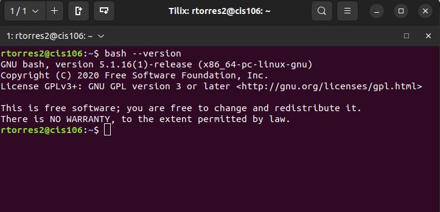
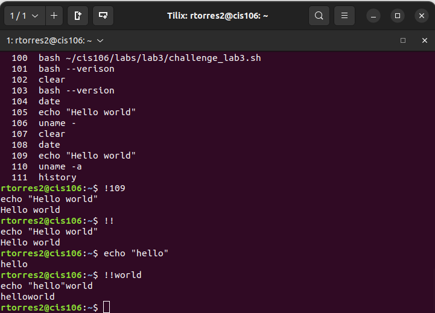
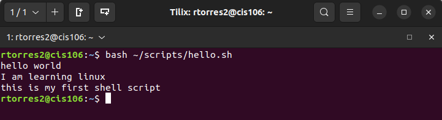
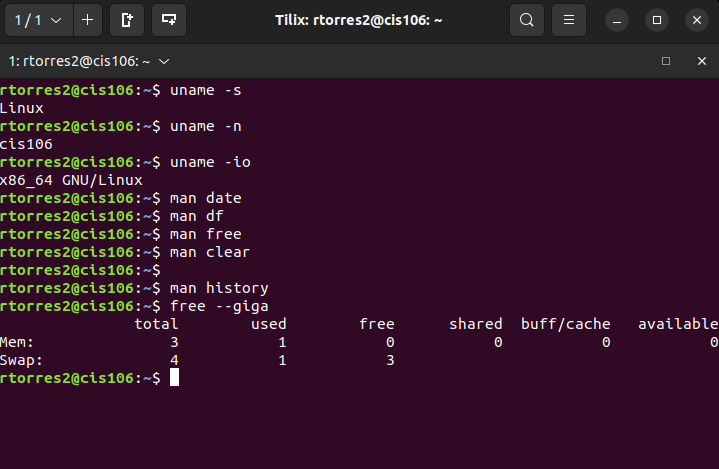
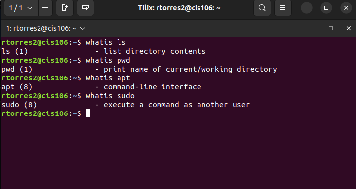
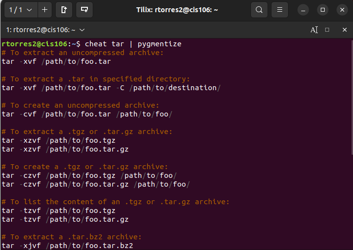
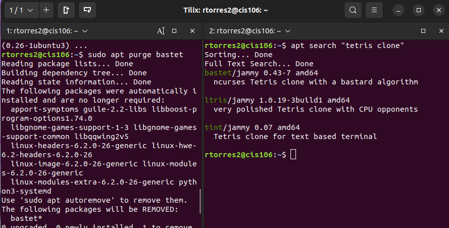

# Week Report 3
## Completed work for week 3
* [Lab 3](../../labs/lab3/lab3.md)
* [Notes 1](../../notes/notes1/notes1.md)

### Practice 2: Accessing the bash shell

### Practice 3: Using the command history

### Practice 4: My first shell script

### Practice 5: Using Man

### Practice 6: Using help

### Practice 7: Cheat

### Practice 1: Managing Software
